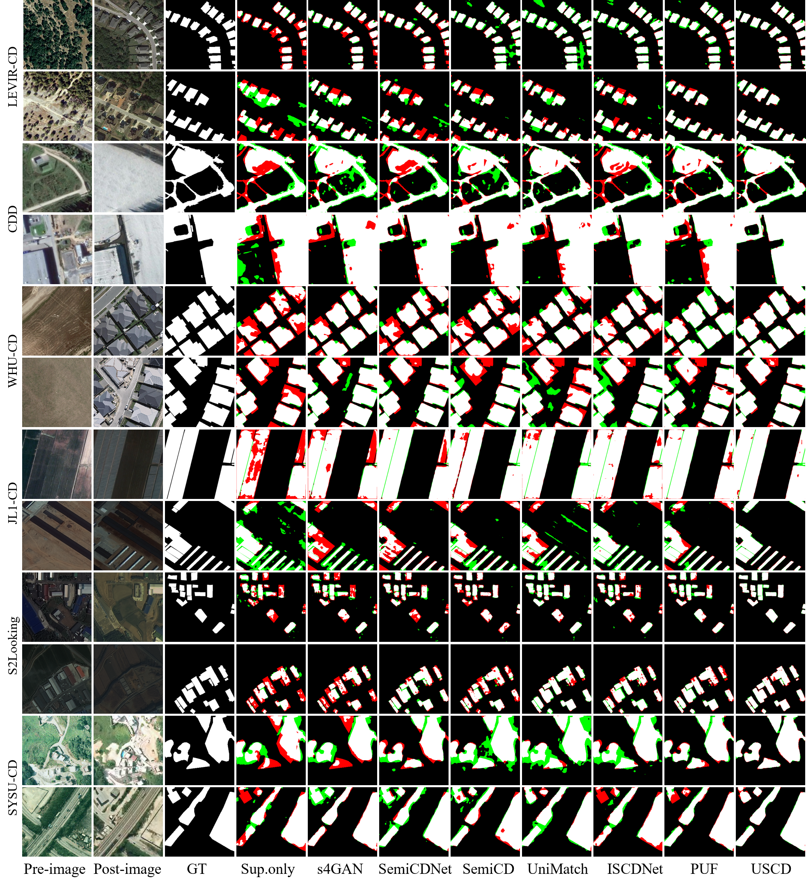
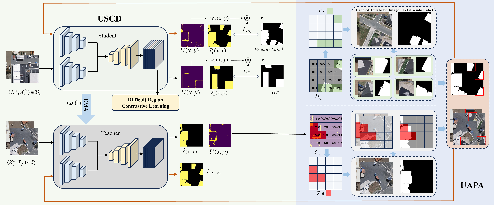
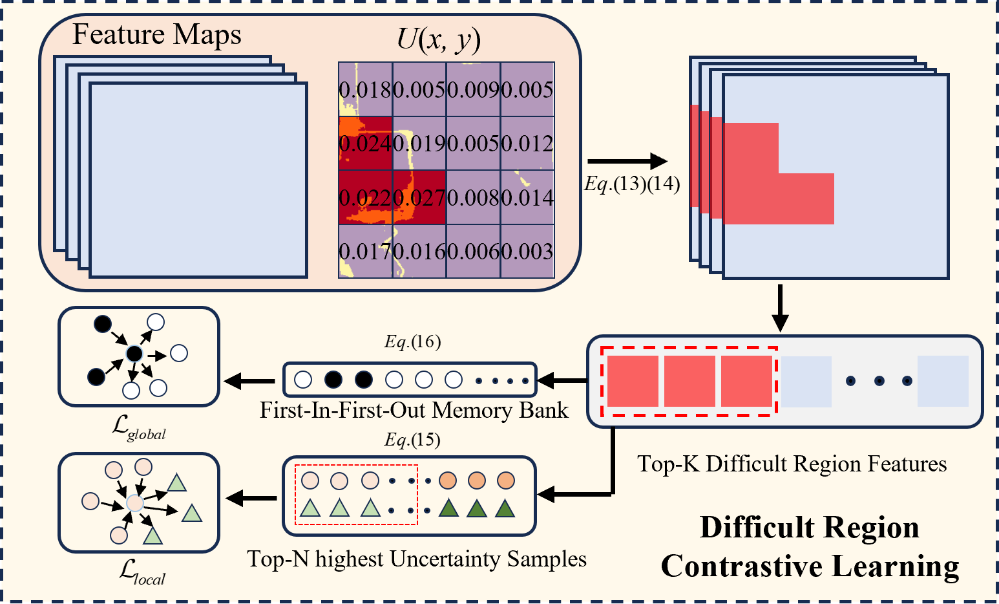

# USCD: Uncertainty-Guided Semi-Supervised Change Detection for Remote Sensing Images

[](https://github.com/G124556/USCD)
[](LICENSE)
[](https://www.python.org/)
[](https://pytorch.org/)

> **Official PyTorch Implementation**  
> **Paper:** *Uncertainty-Guided Semi-Supervised Change Detection for Remote Sensing Images*  
> **Status:** Under Review at IEEE Transactions on Geoscience and Remote Sensing (TGRS)

---

## 📋 Abstract

Semi-supervised change detection in remote sensing images faces a fundamental challenge wherein existing methods employ uniform processing strategies that fail to account for spatial heterogeneity in prediction difficulty. This paper proposes **USCD** (Uncertainty-guided Semi-supervised Change Detection), a novel framework that introduces a **triple-guarantee mechanism** for targeted learning reinforcement in difficult regions based on systematic uncertainty quantification. 

The framework comprises three synergistic components:
- **Uncertainty-Aware Protective Augmentation (UAPA)** - Identifies high-uncertainty regions and implements selective copy-paste augmentation
- **Difficult Region Contrastive Learning (DRCL)** - Enhances feature discriminability through local and global contrastive learning  
- **Uncertainty-Guided Loss Re-weighting (UGLR)** - Applies exponential adaptive weighting for supervision signals

**Code is available at:** https://github.com/G124556/USCD

---

## 🔥 Highlights

- **🎯 Novel Uncertainty-Guided Paradigm**: Utilizes prediction uncertainty as the core signal for identifying difficult regions and guiding differentiated learning
- **🏆 State-of-the-Art Performance**: Achieves superior results across 6 benchmark datasets with limited labeled data (5%-40%)
- **⚡ Efficient Architecture**: Competitive computational efficiency (40.47M params, 29.10G FLOPs) comparable to existing methods
- **🌍 Strong Generalization**: Robust cross-domain transfer capabilities validated through extensive experiments
- **📊 Significant Improvements**: 
  - LEVIR-CD: **90.22% F1** (5% labels) vs 90.01% (previous SOTA)
  - WHU-CD: **89.41% F1** (5% labels) vs 88.80% (previous SOTA)
  - CDD: **87.27% F1** (5% labels) vs 86.26% (previous SOTA)

---

## 🏗️ Architecture

<p align="center">
  
</p>

**USCD Framework Overview:**
- **Teacher-Student Architecture**: EMA-based teacher network provides stable predictions
- **UAPA Module**: Window-based difficulty assessment with dynamic protection strategy
- **DRCL Module**: Dual-level contrastive learning (local anchor-based + global prototype-based)
- **UGLR Module**: Differentiated exponential weighting for labeled and unlabeled data
- **Backbone**: ResNet-50 encoder + DeepLab decoder with ASPP

### Key Innovation: Triple-Guarantee Mechanism

```
Input Images → Uncertainty Quantification (U = 1 - |P₀ - P₁|)
    ↓
UAPA: Protect difficult regions during augmentation
    ↓
DRCL: Enhance features via contrastive learning
    ↓
UGLR: Adaptive loss weighting (↑ labeled, ↓ unlabeled)
    ↓
Precise Change Detection in Difficult Regions
```

---

## 📊 Datasets

We conduct extensive experiments on **six diverse benchmark datasets** covering different scenarios, sensor types, and change characteristics:

| Dataset | Resolution | Size | Train/Val/Test | Time Span | Change Type | Download |
|---------|-----------|------|----------------|-----------|-------------|----------|
| **LEVIR-CD** | 0.5m | 1024×1024 | 7120/1024/2048 | 5-14 years | Building | [Link](https://justchenhao.github.io/LEVIR/) |
| **WHU-CD** | 0.2m | 256×256 | 5947/743/744 | 2012-2016 | Building | [Link](https://gpcv.whu.edu.cn/data/building_dataset.html) |
| **CDD** | 0.03-1.0m | 256×256 | 10000/3000/3000 | Varying | Seasonal | [Link](https://aistudio.baidu.com/datasetdetail/78676) |
| **S2Looking** | 0.5-0.8m | 1024×1024 | 3500/500/1000 | Varying | Building | [Link](https://github.com/S2Looking/Dataset) |
| **SYSU-CD** | 0.5m | 256×256 | 12000/4000/4000 | 2007-2014 | Urban | [Link](https://github.com/liumency/SYSU-CD) |
| **JL1-CD** | 0.5-0.75m | 512×512 | 4000/500/500 | Varying | Building/Urban | [Link](https://github.com/circleLZY/MTKD-CD) |

### Dataset Preparation

Organize your dataset in the following structure:

```
dataset_root/
├── train/
│   ├── A/              # Pre-temporal images
│   ├── B/              # Post-temporal images
│   └── label/          # Binary change masks (0: unchanged, 1: changed)
├── val/
│   ├── A/
│   ├── B/
│   └── label/
└── test/
    ├── A/
    ├── B/
    └── label/
```

---


## 📈 Experimental Results

### Main Results (5% Labeled Data)

| Method | LEVIR-CD | WHU-CD | CDD | S2Looking | SYSU-CD | JL1-CD |
|--------|----------|--------|-----|-----------|---------|--------|
| | F1 / IoU | F1 / IoU | F1 / IoU | F1 / IoU | F1 / IoU | F1 / IoU |
| Sup. only | 69.56 / 49.95 | 72.54 / 60.72 | 75.32 / 59.21 | 42.15 / 26.78 | 75.9 / 61.3 | 54.27 / 37.24 |
| SemiCDNet | 82.69 / 70.48 | 81.48 / 68.75 | 76.74 / 62.27 | 41.34 / 26.12 | 71.9 / 56.2 | 54.51 / 37.47 |
| SemiCD | 85.18 / 74.19 | 79.36 / 65.79 | 78.24 / 64.26 | 46.78 / 30.56 | 78.4 / 64.6 | 57.09 / 39.95 |
| UniMatch | 89.43 / 80.88 | 88.61 / 79.54 | 85.56 / 77.47 | 45.67 / 29.78 | 79.2 / 64.7 | 69.80 / 53.61 |
| CutMix-CD | **90.01** / 81.48 | **88.80** / 81.48 | **86.26** / 77.96 | **54.89** / 38.23 | 78.7 / 64.5 | 65.89 / 49.13 |
| **USCD (Ours)** | **90.22** / **81.56** | **89.41** / **81.52** | **87.27** / **79.02** | **55.82** / **39.18** | **79.8** / **66.5** | **71.15** / **55.23** |
| Oracle | 92.59 / 84.52 | 94.69 / 88.36 | 96.64 / 91.97 | 67.66 / 51.33 | 82.4 / 69.6 | 82.54 / 70.35 |

**Key Observations:**
- 🎯 Consistent improvements across all 6 datasets
- 📊 Maximum gains on challenging datasets (S2Looking: +0.93% F1, JL1-CD: +1.35% F1)
- ⚡ Approaches oracle performance with only 5% labels

### Performance vs. Label Ratio

<p align="center">
  
</p>

### Ablation Study (LEVIR-CD, 5% labels)

| Configuration | F1 | IoU | Δ F1 |
|--------------|-----|-----|------|
| Baseline | 86.34 | 76.92 | - |
| + UAPA | 88.15 | 78.74 | +1.81 |
| + UAPA + DRCL | 89.45 | 80.12 | +1.30 |
| + Full (UAPA + DRCL + UGLR) | **90.22** | **81.56** | +0.77 |

**Component Contributions:**
- **UAPA**: Largest improvement (+1.81% F1) - preserves critical information in difficult regions
- **DRCL**: Significant boost (+1.30% F1) - enhances feature discriminability  
- **UGLR**: Final refinement (+0.77% F1) - balances learning between labeled/unlabeled data

### Cross-Domain Generalization

| Transfer Setting | 5% | 10% |
|-----------------|-----|-----|
| | F1 / IoU | F1 / IoU |
| LEVIR-CD → WHU-CD | 54.69 / 38.42 | 66.95 / 51.32 |
| LEVIR(Sup.) + WHU(Unsup.) → LEVIR | 83.72 / 70.47 | 85.42 / 74.11 |

**Demonstrates:** Strong transferability and effective cross-domain data utilization

---

## ⚙️ Training Details

### Hyperparameters

| Parameter | Value | Description |
|-----------|-------|-------------|
| **Training** | | |
| Total Epochs | 100 | Total training iterations |
| Warmup Epochs | 30 | Supervised warmup phase |
| Batch Size | 8 | Samples per batch |
| Learning Rate | 0.01 → 1e-4 | Linear decay |
| Optimizer | SGD | Momentum=0.9, Weight decay=1e-4 |
| EMA Momentum | 0.999 | Teacher network update |
| **UAPA** | | |
| Window Size (N) | 16 | Grid division size |
| Protection Ratio (β) | 0.3 | Dynamic protection ratio |
| Paste Ratio (ρ) | 0.5 → 0.1 | Decreases with training |
| **DRCL** | | |
| Num Anchors (K) | 32 | Anchor points per batch |
| Num Samples (N) | 64 | Samples per anchor |
| Temperature (τ) | 0.1 | InfoNCE temperature |
| Memory Size | 256 | Prototype bank capacity |
| **UGLR** | | |
| γ_labeled | 2.0 | Weight coefficient (labeled) |
| γ_unlabeled | -1.0 | Weight coefficient (unlabeled) |
| Confidence Threshold | 0.9 | Pseudo-label filtering |
| Contrastive Weight | 0.1 | Loss balance coefficient |

### Training Strategy

```python
# Phase 1: Supervised Warmup (Epochs 1-30)
L_warmup = L_CE(labeled_data)

# Phase 2: Semi-Supervised Learning (Epochs 31-100)
L_total = L_sup + L_unsup + 0.1 × L_contrast
```

**Loss Functions:**
- `L_sup`: Uncertainty-weighted supervised loss (Eq. 20)
- `L_unsup`: Pseudo-label based unsupervised loss (Eq. 21)
- `L_contrast`: DRCL loss (L_local + 0.5 × L_global)
---

## 🔬 Methodology

### 1. Uncertainty Quantification

Pixel-level uncertainty measure:

```
U(x,y) = 1 - |P₀(x,y) - P₁(x,y)|
```

where P₀ and P₁ are prediction probabilities for unchanged and changed classes.

**Properties:**
- U = 1 when P₀ = P₁ = 0.5 (maximum uncertainty)
- U = 0 when model is confident (P₀ ≈ 1 or P₁ ≈ 1)
- Captures decision boundary ambiguity

### 2. Uncertainty-Aware Protective Augmentation (UAPA)

**Window-based Difficulty Assessment:**
```python
1. Divide feature map into N×N windows
2. Compute uncertainty score: S_ij = mean(U) over window
3. Select top-K windows with highest uncertainty as protected regions
4. Apply copy-paste to non-protected regions only
```

**Dynamic Protection Strategy:**
```
K = ⌊β × (t/T) × N²⌋
```
- Increases protection gradually during training
- Prevents loss of discriminative information

### 3. Difficult Region Contrastive Learning (DRCL)

**Local Contrastive Learning:**
- Anchor-based hard sample mining within difficult regions
- Select top-N highest-uncertainty samples from reliable sets
- InfoNCE loss with positive/negative pairs

**Global Contrastive Learning:**
- Prototype memory banks (M⁺/M⁻) for foreground/background
- Contrast current batch prototypes with historical prototypes
- Provides class-level semantic guidance

### 4. Uncertainty-Guided Loss Re-weighting (UGLR)

**Differentiated Weighting:**

For labeled data (strengthen difficult regions):
```
w_L(x,y) = exp(γ_L × U(x,y)), γ_L = 2.0 > 0
```

For unlabeled data (suppress unreliable regions):
```
w_U(x,y) = exp(γ_U × U(x,y)), γ_U = -1.0 < 0
```

**Rationale:**
- High-uncertainty labeled regions contain valuable discriminative information
- High-uncertainty unlabeled regions likely contain noisy pseudo-labels

---

## 📊 Evaluation Metrics

We report the following standard metrics:

| Metric | Formula | Description |
|--------|---------|-------------|
| **Precision** | TP / (TP + FP) | Accuracy of positive predictions |
| **Recall** | TP / (TP + FN) | Coverage of actual positives |
| **F1-Score** | 2 × (Prec × Rec) / (Prec + Rec) | Harmonic mean of precision and recall |
| **IoU** | TP / (TP + FP + FN) | Intersection over Union (Jaccard Index) |
| **OA** | (TP + TN) / Total | Overall Accuracy |

where TP (True Positive), FP (False Positive), TN (True Negative), FN (False Negative).

---

## 🎨 Qualitative Results

<p align="center">
  
</p>

**Observations:**
- ✅ USCD produces cleaner boundaries and more complete change regions
- ✅ Significantly reduces false positives (red) and false negatives (green)
- ✅ Excels in challenging scenarios: complex backgrounds, small changes, subtle boundaries
- ✅ Uncertainty maps show reasonable distribution concentrated at difficult regions

---

## 💡 Key Contributions

1. **Novel Uncertainty-Guided Paradigm**: First to systematically utilize prediction uncertainty as the core signal for identifying and reinforcing learning in difficult regions

2. **Complete Framework Design**: Three synergistic components (UAPA, DRCL, UGLR) that collectively address the challenge of spatial heterogeneity in change detection

3. **State-of-the-Art Performance**: Extensive validation on 6 diverse datasets demonstrates consistent improvements, especially under limited supervision (5%-40% labels)

4. **Strong Generalization**: Cross-domain experiments validate robust transferability and effective utilization of unlabeled data from different domains

5. **Competitive Efficiency**: Achieves superior performance with computational cost comparable to existing methods (40.47M params, 394.5s/epoch)

---

## 🙏 Acknowledgments

This work is built upon several excellent repositories and datasets:

- **PyTorch**: Deep learning framework
- **torchvision**: Pre-trained ResNet-50 backbone
- **Albumentations**: Data augmentation library
- **Dataset Providers**: LEVIR-CD, WHU-CD, CDD, S2Looking, SYSU-CD, JL1-CD

We thank the authors of the baseline methods for making their code publicly available:
- UniMatch ([Yang et al., CVPR 2023](https://github.com/LiheYoung/UniMatch))
- SemiCD ([Bandara & Patel, arXiv 2022](https://github.com/wgcban/SemiCD))
- CutMix-CD ([Shu et al., TGRS 2024](https://github.com/qaz670756/CutMix-CD))

---


**Status**: Active Development | Paper Under Review

---

<p align="center">
  <b>⭐ If you find this work helpful, please consider giving us a star! ⭐</b>
</p>
